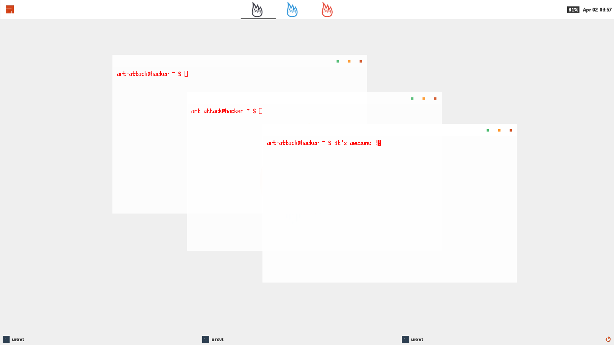

**Theme for awesome_wm_ 3.5**

:Author: Arpan Biswas
:License: BY-NC-SA_

TODO
==========

Just copy all the files and folders to your ~/.config/awesome directory and done.

*use git:*

 # git clone https://github.com/talk2william/awesome-anxiety.git
 
 # cp -rf awesome-anxiety/* ~/.config/awesome/
 
*or download the zip_ and extract it inside the ~/.config/awesome directory.*

- *for best optimization you must need this all:*

- *compton_ (shadding/effects)*

- *rxvt (terminal) if you want to use my* Xresources_

- *scrot (take screenshot)*

**USAGE**

- Touch top-left corner to toggle navbar.

- Use modkey + f to fullscreen videos and players.

**NOTE**

This theme uses museosansrounde_ font so, you need to install it.

**Anxiety Original**

for more preview, look here_

.. _BY-NC-SA: http://creativecommons.org/licenses/by-nc-sa/3.0/
.. _compton: https://github.com/chjj/compton
.. _here: /snaps/original/
.. _zip: https://github.com/talk2william/awesome-anxiety/archive/master.zip
.. _Xresources: /.Xresources
.. _museosansrounde: /museosansrounded-900-webfont.ttf
